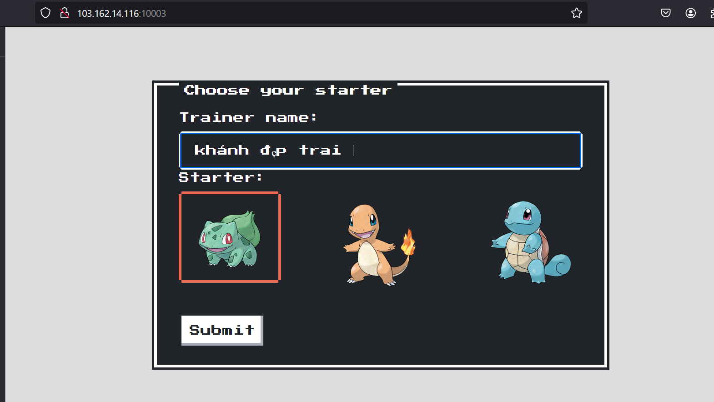
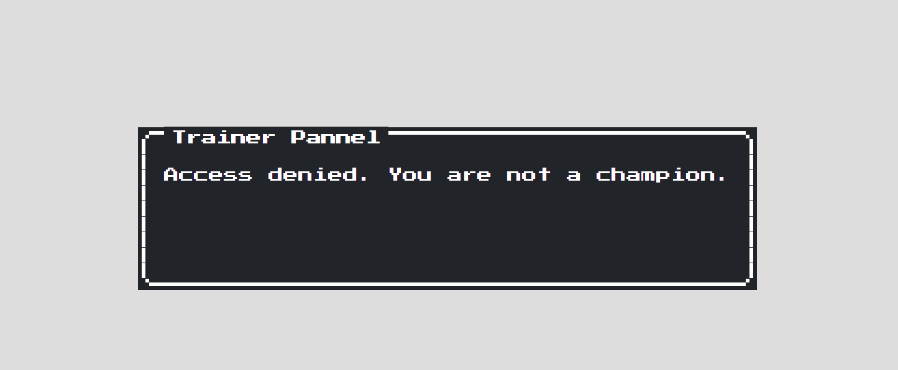
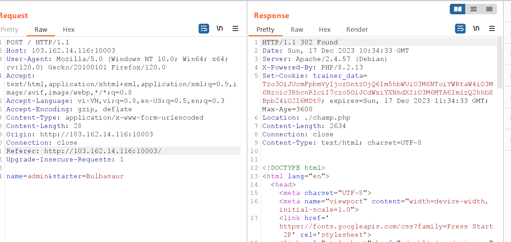
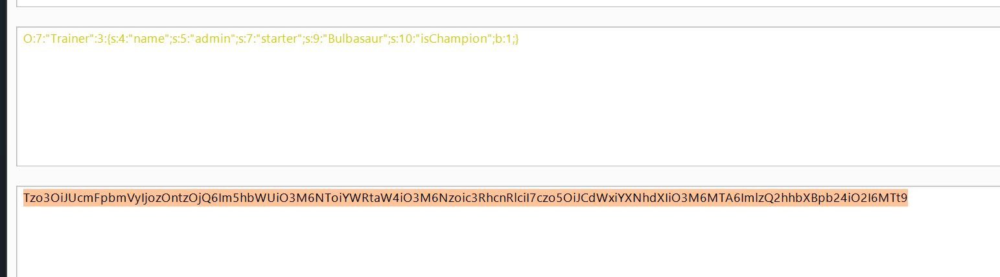

# Pokemon Hof Panel Level 1 
> Mở đầu khởi động bằng chall với lỗ hổng Object Injection PHP , nếu bạn nào chưa biết thì mình có thể nói qua , lỗ hổng này sinh ra khi chúng ta đóng gói một obj thành 1 dạng dữ liệu để lưu trữ hoặc chuyển đi , thụât ngữ của quá trình này gọi là **serialize** dữ liệu khi xong gọi là **serialize data** có thể dưới nhiều dạng khác nhau như byte hoặc string.Ngược lại với quá trình này ta có **unserialize** là từ các dạng **serialize data** chúng ta khôi phục lại được object ban đầu. Vấn đề nằm ở khâu trung gian , chúng ta có thể tiêm 1 **serialize data** mà nó sẽ dựa vào logic src mà thực hiện điều mà ta mong muốn ,chứ không phải dev mong muốn (hehehe!)
các bạn có thể tham khảo thêm ở đây :> 
[object injection PHP](https://youtu.be/-VG9ujeYu9o?si=DducDajbQ-RMxI5a)

## Vào đề 
Giao diện khi chúng ta vào : 

Đề cho chúng ta điền tên người chơi và chọn pikachu :>  rồi bấm submit 

```
include("./classes/trainer.php");

if ($_SERVER["REQUEST_METHOD"] == "POST") {
    if (isset($_POST["name"])) {
        $name = $_POST["name"];
        $starter = $_POST["starter"];
        $user = new Trainer($name, $starter);
        $serializedUser = serialize($user);
        $base64Encoded = base64_encode($serializedUser);
        setcookie("trainer_data", $base64Encoded, time() + 3600);
        header("Location: ./champ.php");
    }
}
```
Đây là đoạn code xử lí việc đó : 
Nó lấy dữ liệu của mình ném vào hai thuộc tính của obj thuộc class *Trainer* rồi seialize đưa vào biến cookie , rồi chuyển mình qua *./champ.php* 

tại "./champ" thì nó xử lí , lấy giá trị chính là **serialize data** mà mình nói ở trên =>  tiến hành khôi phục lại obj ,sau đó check mình có là nhà vô địch hay không ? nếu có thì bắn flag ra cho mình !
```
function isChampion($user) {
    return $user->getChampion();
}

if (isset($_COOKIE["trainer_data"])) {
    $base64Encoded = $_COOKIE["trainer_data"];
    $serializedUser = base64_decode($base64Encoded);
    $user = unserialize($serializedUser);
    if (isChampion($user)) {
        $title = "Champion Pannel";
        $msg = "Hello, " . $user->getname() . " KCSC{level1_fakeflag}";
    } else {
        $title = "Trainer Pannel";
        $msg = "Access denied. You are not a champion.";
    }
} else {
    $title = "Something's wrong!!!";
    $msg = "No trainer data found. Please choose your starter.";
}
```
Cùng nhìn vào class *Trainer* 
```
class Trainer {
    public $name;
    public $starter;
    public $isChampion;

    public function __construct($name, $starter) {
        $this->name = $name;
        $this->starter = $starter;
        $this->isChampion = false;
    }
    public function getname() {
        return $this->name;
    }
    public function getChampion() {
        return $this->isChampion;
    }
    public function setname($name) {
        $this->name = $name;
    }
}
```
*__contructer()* mặc định khởi tạo mình không phải là nhà vô địch nhưng mà nó lưu **serialize data** vào biến cookie -> mà cookie ở client , mình có thể can thiệp được 
ban đầu dữ liệu nó sẽ như thế này nếu mà mình không can thiệp : 
```
O:7:"Trainer":3:{s:4:"name";s:5:"admin";s:7:"starter";s:9:"Bulbasaur";s:10:"isChampion";b:0;}
```
và kết quả 


hàm **serialize()** nó sẽ đóng gói các thuộc tính vào 
Ví dụ ta focus vào *isChampion";b:0;* => chính là thuộc tính isChampion , b:bool,0:false ( đang nhận giá trị sai )
=> giờ muốn là nhà vô định thì mình chỉ cần chỉnh 0 thành 1 (true) là done 
Tiến hành ! 
Cách này của mình có thể hơi lằng nhằng, bạn có thể thay trực tiếp vào value cookie trên trình duyệt nhé ( nhớ encode base64 , vì sao ư :>>  vì src nó bảo thế )
Bắt request bằng burp suite rồi đưa nó sang repeater!

bạn thấy sever nó trả cho mình 1 cookie không ? => giờ lấy đoạn cookie(cookie đã được sửa) đó ném vào method GET /champ 

và mình đã có flag 

# FLAG 
**KCSC{n0w_y0u_kn0w_s3r1al1z3_f0m4rt}**