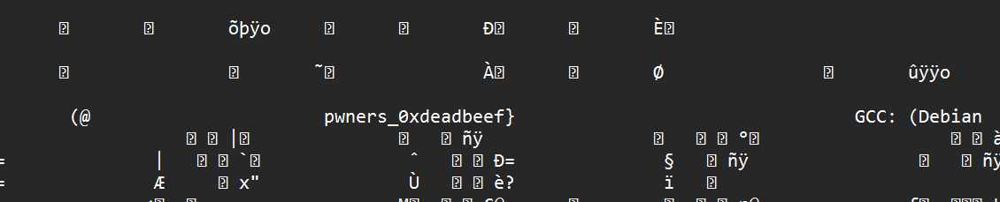

#  A gift for pwners 

đúng như tên bài là món quà :>
đề cho 1 file , mình mở file đó bằng notepad thì thấy ngay 2 phần của flag 
Part 1 : 


Part 3 : (vì nó nói là second part được dấu trong 1 func nào đó )



mình tiến hành đưa file vào ida , mò từng func ( chọn xem pesudo code của nó)

và Part2 : 


# FLAG

```
KCSC{A_gift_for_the_pwners_0xdeadbeef}
```