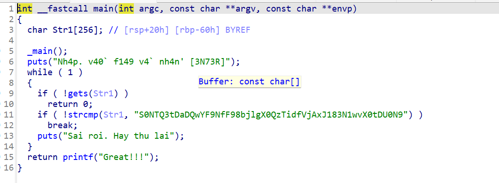
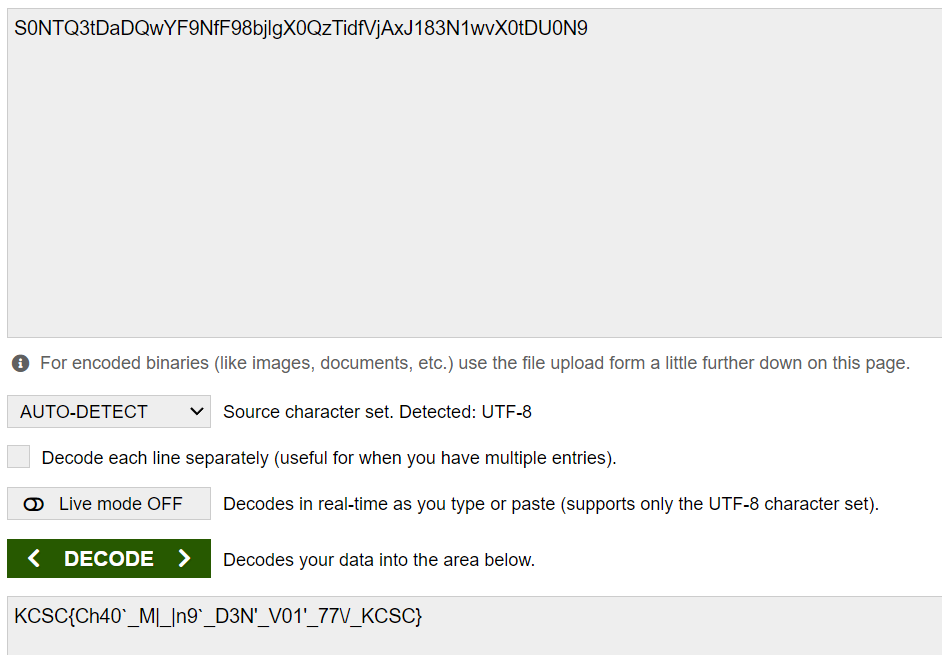

# Real Warmup 

bài này đề cho mình 1 file : **chall.exe**
ném file vào ida 
vào hàm main và xem pseudo code của nó 



hàm main yêu cầu mình nhập 1 string rồi so sánh input với 
```
S0NTQ3tDaDQwYF9NfF98bjlgX0QzTidfVjAxJ183N1wvX0tDU0N9
```
thử decode base64 đoạn string trên ! 



và ta có flag

#FLAG 
```
KCSC{Ch40`_M|_|n9`_D3N'_V01'_77\/_KCSC}
```